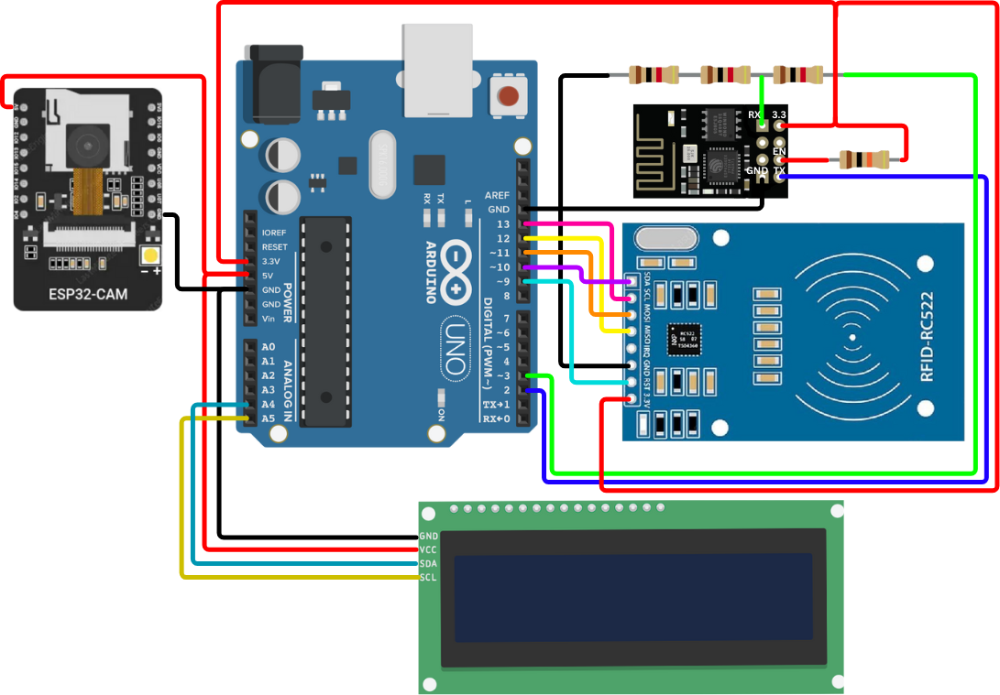

# RFID and Face Recognition Based Authentication System



This project integrates **RFID card scanning**, **ESP32-CAM facial recognition**, and a **Python server** to verify a person's identity using both card and face authentication. Designed with hardware-software interaction in mind, this system is ideal for smart access control solutions like digital gates, classrooms, or secure labs.

---

## 🧠 Overview

- **User scans RFID card.**
- **LCD prompts user to show face to the camera.**
- **ESP32-CAM captures the image and streams it to the server.**
- **Python server compares the captured image with a stored reference image.**
- **Authentication result is sent back to Arduino via ESP8266.**
- **LCD displays if the face was recognized.**

---

## 🔧 Components Used

| Component         | Description                      |
|------------------|----------------------------------|
| Arduino Uno       | Main controller                  |
| ESP32-CAM         | Captures and streams live image  |
| ESP8266 Wi-Fi Module | Sends/receives data between Arduino and PC |
| RC522 RFID Reader | Reads RFID cards                 |
| I2C LCD Display   | Displays messages to the user    |
| PC with Python    | Runs face recognition and acts as the server |

---

## 💻 Software Stack

- **Arduino IDE**
- **ESP32-CAM Camera Web Server**
- **Python 3 (OpenCV + Selenium)**
- **ChromeDriver for Selenium**
- **Socket programming for Arduino-PC communication**

---

## 📁 File Structure

```bash
project/
├── CIRCUITDIAGRAM.png             # Circuit diagram
├── arduino_code.ino              # Arduino Uno sketch
├── esp32_code.ino                # ESP32-CAM code
├── server.py                     # Python face recognition server
└── images/
    └── <RFID_UID>/
        ├── sample1.jpg           # Reference image of authorized user
        └── <username>.txt        # Text file with username
```

---

## 🔌 Wiring / Circuit

The circuit wiring connects:

- **ESP32-CAM** to PC via Wi-Fi  
- **RC522 RFID** to Arduino via SPI  
- **LCD I2C Display** to Arduino (SDA/SCL)  
- **ESP8266 Wi-Fi module** to Arduino using SoftwareSerial (D2/D3)  

Refer to the image [`CIRCUITDIAGRAM.png`](./CIRCUITDIAGRAM.png) for detailed connections.

---

## 🚀 How to Run

### 1. Arduino Setup
- Upload `arduino_code.ino` to Arduino Uno.
- Connect RFID and LCD as per circuit.
- Replace `ssid` and `password` with your Wi-Fi credentials in the Arduino code.

### 2. ESP32-CAM Setup
- Flash `esp32_code.ino` using Arduino IDE with correct board & partition settings.
- Ensure Wi-Fi credentials are updated.

### 3. Python Server Setup
- Install dependencies:
  ```bash
  pip install opencv-python selenium requests numpy
  ```
- Place a reference face image in: `images/<RFID_UID>/sample1.jpg`
- Save user name in: `images/<RFID_UID>/<username>.txt`
- Update the `ip` in `server.py` to match Arduino's IP.
- Run the server:
  ```bash
  python server.py
  ```

---

## 🧪 Sample Flow

1. User taps RFID card.
2. LCD shows “Show face to camera”.
3. ESP32-CAM captures a photo and streams it.
4. Python compares the new image with the stored one using OpenCV.
5. Server sends back result to Arduino (recognized or not).
6. LCD shows result and returns to idle.

---

## ⚙️ Future Improvements

- Replace OpenCV template matching with deep learning-based face recognition (e.g., FaceNet, dlib).
- Add SD card support on ESP32 to store captured images.
- Use secure MQTT/HTTPS communication instead of plain sockets.
- Add database to track attendance or access logs.

---

## 📚 Learnings

- Working with AT commands to communicate with ESP8266
- Using OpenCV for basic face detection and template matching
- Interfacing multiple modules (RFID, camera, LCD, Wi-Fi) with microcontrollers
- Full-stack hardware-software integration

---

## ✨ Credits

- OpenCV for face recognition  
- Arduino and ESP32 open-source communities  
- Dhananjayan Seshadri

---

## 📝 License

This project is open source and free to use for academic and non-commercial purposes.
